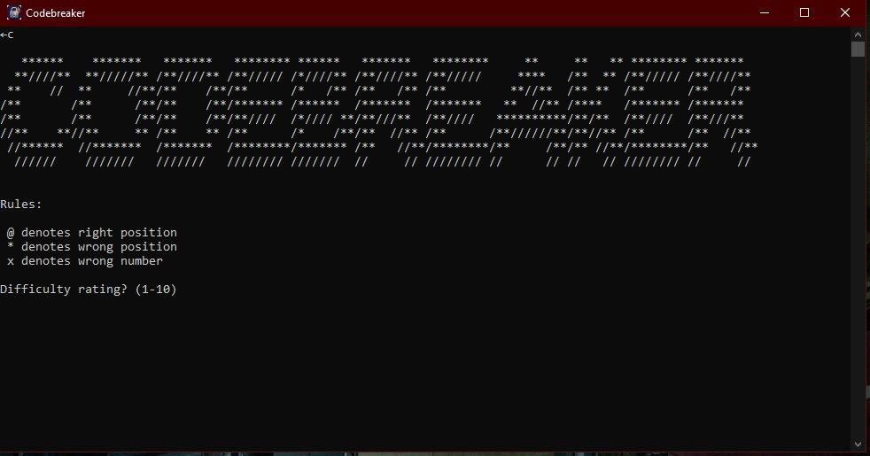
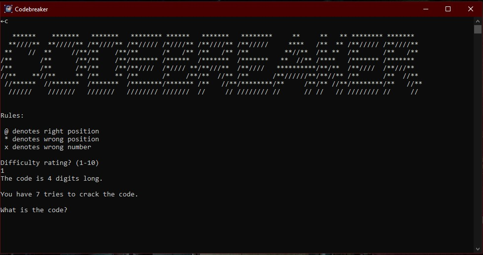
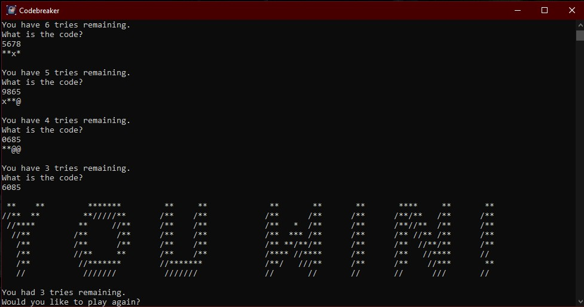

 
# CODEBREAKER 

**Version:** 1.1  
**Author:** Bryce Planchard  
**License:** [MIT License](LICENSE.txt)  
**Website / Repo:** [https://github.com/IronforgedDwarf/CODEBREAKER](https://github.com/IronforgedDwarf/CODEBREAKER)

---

## Overview

CODEBREAKER is a puzzle/logic game written in Python. This repository includes both the **source code** and a **Windows installer** for easy setup.

---

## Installer

The installer is included in the repository:  

**File:** `Install.exe`

### Installation Steps

1. Download or clone this repository.  

2. Double-click `Install.exe`.  

3. Follow the installation wizard instructions.  

4. Once installed, you can run CODEBREAKER from the Start Menu or Desktop shortcut.  

> **Note:** You can also run the program directly from source using Python (see **Running from Source** below).

---

## Running from Source

1. Ensure you have **Python 3.10+** installed.  

2. Clone this repository:  

    ```bash
    git clone https://github.com/IronforgedDwarf/CODEBREAKER.git
    ```

3. Navigate to the project folder:  

    ```bash
    cd CODEBREAKER
    ```

4. Run the program:  

    ```bash
    python CODEBREAKER.py
    ```

---

## Features

- Adjustable difficulty  
- Custom AI-generated icon  
- Installer provided  

---

## License

This project is licensed under the [MIT License](LICENSE.txt).

---

## Screenshots

### Main Menu


### Difficulty Selection


### Victory Screen


---

## Known Issues

- Entering fewer digits than expected results in confusing indicators (the missing digits may be added to the front as "wrong number").
- Entering dumplicate numbers results in different responses, but does NOT indicate if a digit it duplicated, (limitation of design).
- Screen does not clear properly at game start and restart. (Written in 2019; likely an easy fix.)(update: I was wrong, looks like a limitation)
