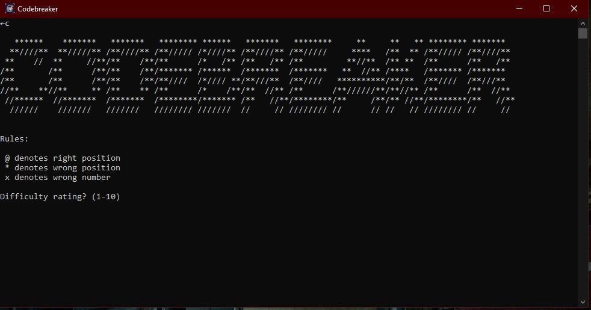
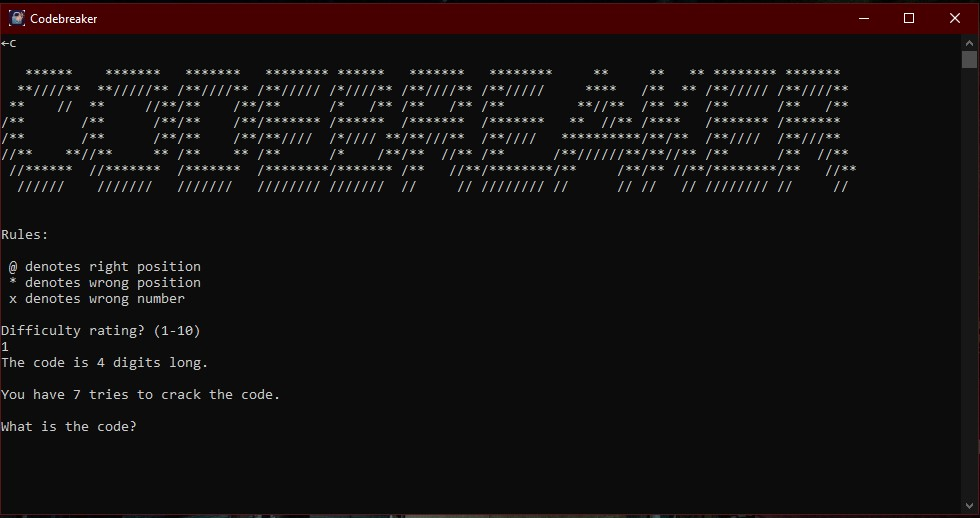
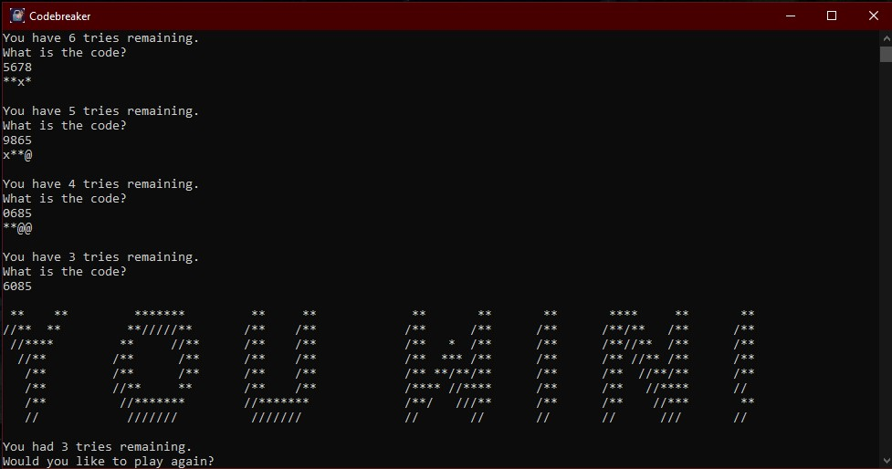

CODEBREAKER

Version: 1.1
Author: Bryce Planchard
License: MIT License
Website / Repo: https://github.com/IronforgedDwarf/CODEBREAKER

Overview

CODEBREAKER is a puzzle/logic game written in Python. This repository includes both the source code and a Windows installer for easy setup.

Installer

The installer is included in the repository:
File: Install.exe

Installation Steps

Download or clone this repository.
Double-click CODEBREAKER Install.exe.
Follow the installation wizard instructions.
Once installed, you can run CODEBREAKER from the Start Menu or Desktop shortcut.
Note: If you prefer, you can also run the program directly from source using Python (see Running from Source below).

Running from Source

Make sure you have Python 3.10+ installed.
Clone this repository:
git clone https://github.com/IronforgedDwarf/CODEBREAKER.git
Navigate to the project folder:
cd CODEBREAKER
Run the program:
python CODEBREAKER.py

Features

Adjustable difficulty
Custom AI generated ICON
Installer provided
License

This project is licensed under the MIT License.

Screenshots

### Main Menu

### Difficulty Selection

### Victory Screen

Known Issues
Entering less than the amount of digits results in confusing indicators (I think the missing digits are added to the front of the indicators as "wrong number")
Screen does not clear properly for game start and restart. (I wrote this in 2019, its probably an easy fix)
